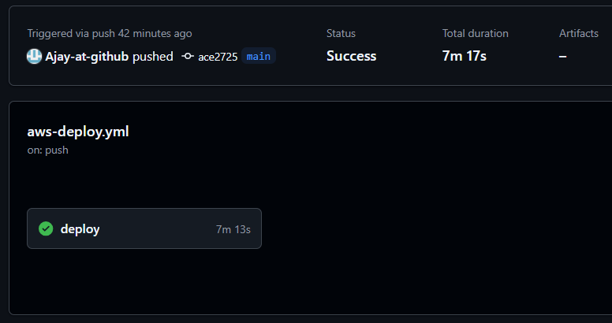

# CI/CD Workflow for Deploying Static Web Applications using MLOps Tools

## Summary:

This repository demonstrates how to deploy an end-to-end machine learning application using CI/CD pipelines and GitHub Actions, integrated with Amazon ECR and Amazon ECS (Fargate). It provides a practical, hands-on approach to deploying ML models in production, making it easier for developers—especially beginners—to adopt MLOps workflows. By leveraging GitHub Actions for automation and AWS services for containerization and deployment, this project streamlines the delivery process, ensuring that machine learning models remain up-to-date, scalable, and accessible.


     
### Run in localhost:

```zsh
git clone https://github.com/Ajay-at-github/mlops-static-web-deployment.git
python -m venv venv
source venv/bin/activate
#test training
python setup.py install
python src/components/data_ingestion.py 
```

### Build the Docker image
```
docker build -t <aws_account_id>.dkr.ecr.ap-south-1.amazonaws.com/<repository_name>:latest .
```
### Authenticate Docker to your Amazon ECR registry
```
aws ecr get-login-password --region ap-south-1 | docker login --username AWS --password-stdin <aws_account_id>.dkr.ecr.ap-south-1.amazonaws.com
```
### Push the image to ECR
```
docker push <aws_account_id>.dkr.ecr.ap-south-1.amazonaws.com/<repository_name>:latest
```
### Result


Website url: http://13.203.26.158:5000/
